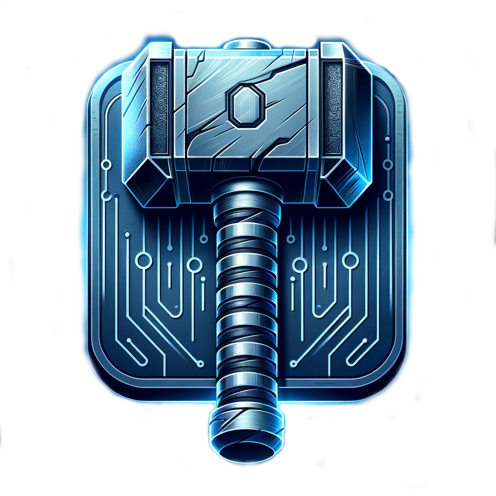

# Thor
## (Tensor Hyper-parallel Optimized pRocessing)

Design Objectives:
1. Efficiency
2. Performance
3. Scaling
4. Ease of use
5. Full featured

This framework is for Linux, and is currently being developed using Ubuntu 22.04 and Cuda 13.0, using an Nvidia GPU of compute capability >= 7.5.

## Quick start using cmake

#### Build
mkdir build  
cd build  

cmake -G Ninja -DCMAKE_BUILD_TYPE=Release ..  
-- or --  
cmake -G Ninja -DCMAKE_BUILD_TYPE=Debug ..  
-- or --  
cmake -G Ninja -DCMAKE_BUILD_TYPE=RelWithDebInfo ..  

cmake --build .

#### Run tests

from Thor/build:  

cmake --build . --target check  
-- or --  
cmake --build . --target check-cpp  
-- or --  
cmake --build . --target check-python  
-- or --  
./thor_tests --gtest_filter=FullyConnectedTest.*  
-- or --  
./thor_tests --gtest_filter=FullyConnectedTest.SerializeProducesExpectedJson  
-- or --  
source ../.venv/bin/activate  
pytest ...
